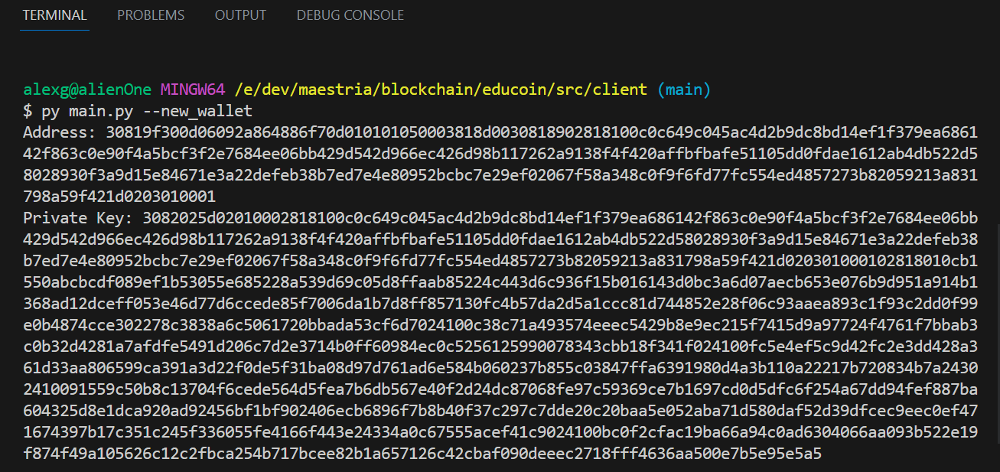
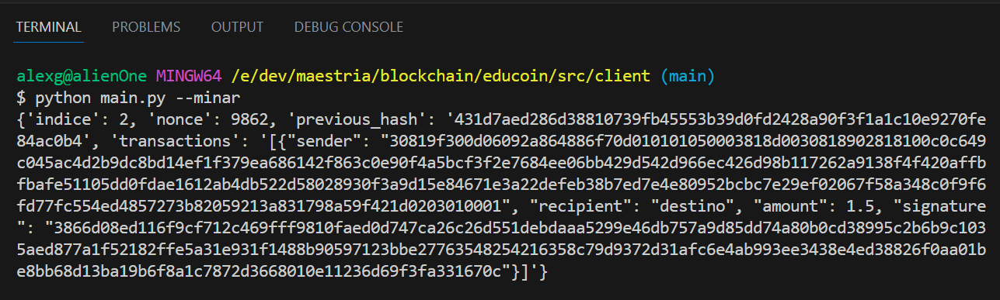
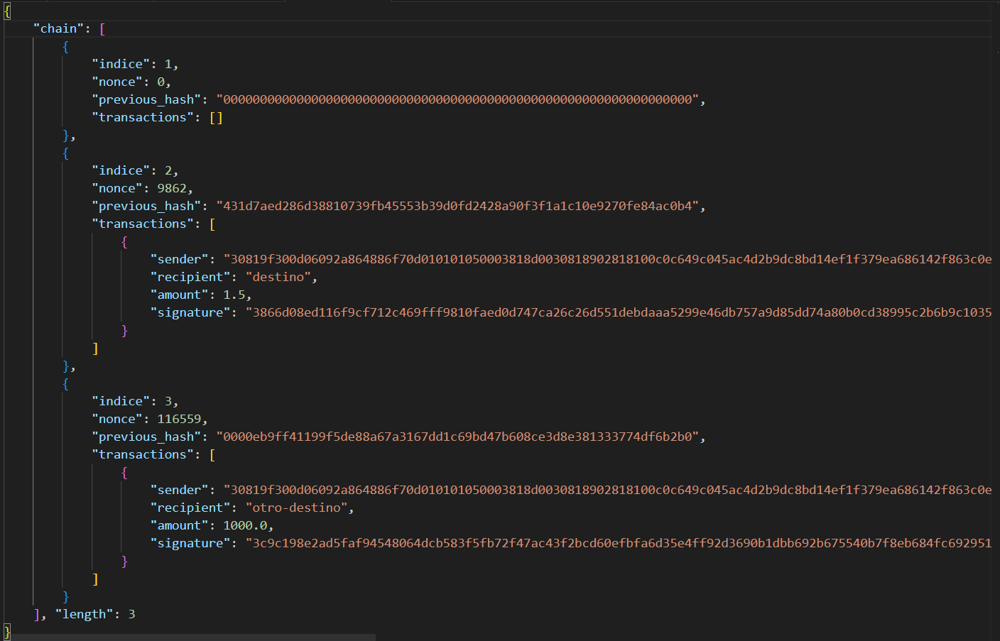

# Bienvenido al proyecto EduCoin

**EduCoin** es una cadena de bloques basica que sirve como prueba de concepto

## Ejecutar la cadena de bloques

Este proyecto esta divido en 3 aplicaciones:

- src/client: permite generar e introducir en la cadena de bloques
- src/node: software que controla la cadena de bloques, debe ejecutarse en cada nodo de la red
- src/network: directorio con las direcciones de todos los nodos registrados en la red

lo primero que tienes que hacer es ejecutar la aplicacion de nodos, debes entrar en el
folder src/nodes y ejecutar el archivo index.py pasando como parametro el puerto que
utilizará para recibir peticiones.

`python index.py -p 5001`

una vez que por lo menos un nodo este corriendo podemos utilizar el cliente en src/client para acceder a la cadena de bloques, lo primero que debemos hacer es crear una billetera.

`python main.py --wallet`

esto generara tu direccion y tu llave privada, debes almacenarlas para poder realizar
transacciones.

ahora que tenemos nuestra billetera podemos enviar transacciones a los nodos de la siguiente
manera:

`python main.py --transaction -pubk <public-key> -prvk <private-key> -r <destino> -a <monto>`

recibiras una respuesta indicando el bloque en el que será agregada la transaccion

despues de enviar algunas transacciones puedes pedirle al nodo que mine el bloque
para que se agregue a la cadena y tus transacciones queden incluidas.

`python main.py --minar`

recibiras como respuesta el bloque minado

por ultimo si deseas visualizar toda la cadena de bloques completa puedes usar
el siguiente comando

`python main.py --blockchain`

## Notas

Aun no se implementa la funcionalidad del diccionario de nodos, aunque ya esta hecha los nodos no lo
utilizan aún.
